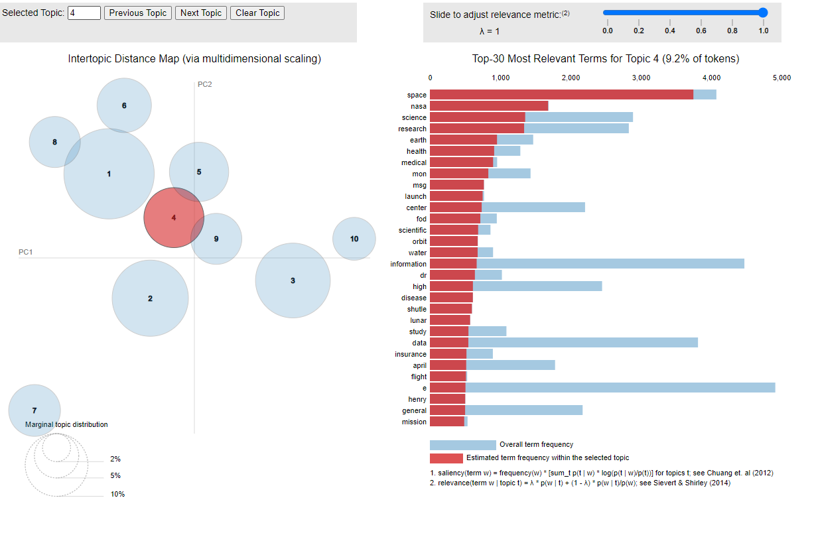

# Finding hide topics on raw text data

> Run `topic_generaiton.py` to generate topics using [Latent Dirichlet Allocation (LDA)](https://www.jmlr.org/papers/volume3/blei03a/blei03a.pdf) technique.

> The generated topics can be seen through the `topics.html` file, generated by the [pyLDAvis](https://github.com/bmabey/pyLDAvis) library.

> Generated Example `vis_example.png`:

 

